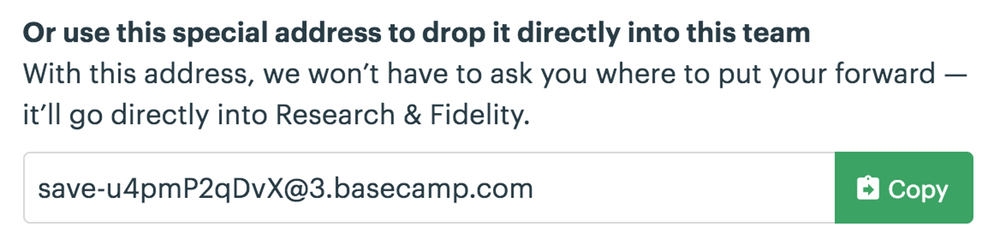

# Building Something Real

We've implemented our first controller and learned how Stimulus connects HTML to JavaScript. Now let's take a look at something we can use in a real application by recreating a controller from Basecamp.

## Wrapping the DOM Clipboard API

Scattered throughout Basecamp's UI are buttons like these:



When you click one of these buttons, Basecamp copies a bit of text, such as a URL or an email address, to your clipboard.

The web platform has [an API for accessing the system clipboard](https://www.w3.org/TR/clipboard-apis/), but there's no HTML element that does what we need. To implement a "Copy to clipboard" button, we must use JavaScript.

## Implementing a Copy Button

Let's say we have an app which allows us to grant someone else access by generating a PIN for them. It would be convenient if we could display that generated PIN alongside a button to copy it to the clipboard for easy sharing.

Open `public/index.html` and replace the contents of `<body>` with a rough sketch of the button:

```html
<div>
  PIN: <input type="text" value="1234" readonly>
  <button>Copy to Clipboard</button>
</div>
```

## Setting Up the Controller

Next, create `src/controllers/clipboard_controller.js` and add an empty method `copy()`:

```js
// src/controllers/clipboard_controller.js
import { Controller } from "@hotwired/stimulus"

export default class extends Controller {
  copy() {
  }
}
```

Then add `data-controller="clipboard"` to the outer `<div>`. Any time this attribute appears on an element, Stimulus will connect an instance of our controller:

```html
<div data-controller="clipboard">
```

## Defining the Target

We'll need a reference to the text field so we can select its contents before invoking the clipboard API. Add `data-clipboard-target="source"` to the text field:

```html
  PIN: <input data-clipboard-target="source" type="text" value="1234" readonly>
```

Now add a target definition to the controller so we can access the text field element as `this.sourceTarget`:

```js
export default class extends Controller {
  static targets = [ "source" ]

  // ...
}
```

> ### What's With That `static targets` Line?
>
> When Stimulus loads your controller class, it looks for target name strings in a static array called `targets`. For each target name in the array, Stimulus adds three new properties to your controller. Here, our `"source"` target name becomes the following properties:
>
> * `this.sourceTarget` evaluates to the first `source` target in your controller's scope. If there is no `source` target, accessing the property throws an error.
> * `this.sourceTargets` evaluates to an array of all `source` targets in the controller's scope.
> * `this.hasSourceTarget` evaluates to `true` if there is a `source` target or `false` if not.
>
> You can read more about targets in the [reference documentation](/reference/targets).

## Connecting the Action

Now we're ready to hook up the Copy button.

We want a click on the button to invoke the `copy()` method in our controller, so we'll add `data-action="clipboard#copy"`:

```html
  <button data-action="clipboard#copy">Copy to Clipboard</button>
```

> ### Common Events Have a Shorthand Action Notation
>
> You might have noticed we've omitted `click->` from the action descriptor. That's because Stimulus defines `click` as the default event for actions on `<button>` elements.
>
> Certain other elements have default events, too. Here's the full list:
>
> | Element           | Default Event |
> | ----------------- | ------------- |
> | a                 | click         |
> | button            | click         |
> | details           | toggle        |
> | form              | submit        |
> | input             | input         |
> | input type=submit | click         |
> | select            | change        |
> | textarea          | input         |

Finally, in our `copy()` method, we can select the input field's contents and call the clipboard API:

```js
  copy() {
    navigator.clipboard.writeText(this.sourceTarget.value)
  }
```

Load the page in your browser and click the Copy button. Then switch back to your text editor and paste. You should see the PIN `1234`.

## Stimulus Controllers are Reusable

So far we've seen what happens when there's one instance of a controller on the page at a time.

It's not unusual to have multiple instances of a controller on the page simultaneously. For example, we might want to display a list of PINs, each with its own Copy button.

Our controller is reusable: any time we want to provide a way to copy a bit of text to the clipboard, all we need is markup on the page with the right annotations.

Let's go ahead and add another PIN to the page. Copy and paste the `<div>` so there are two identical PIN fields, then change the `value` attribute of the second:

```html
<div data-controller="clipboard">
  PIN: <input data-clipboard-target="source" type="text" value="3737" readonly>
  <button data-action="clipboard#copy">Copy to Clipboard</button>
</div>
```

Reload the page and confirm that both buttons work.

## Actions and Targets Can Go on Any Kind of Element

Now let's add one more PIN field. This time we'll use a Copy _link_ instead of a button:

```html
<div data-controller="clipboard">
  PIN: <input data-clipboard-target="source" type="text" value="3737" readonly>
  <a href="#" data-action="clipboard#copy">Copy to Clipboard</a>
</div>
```

Stimulus lets us use any kind of element we want as long as it has an appropriate `data-action` attribute.

Note that in this case, clicking the link will also cause the browser to follow the link's `href`. We can cancel this default behavior by calling `event.preventDefault()` in the action:

```js
  copy(event) {
    event.preventDefault()
    navigator.clipboard.writeText(this.sourceTarget.value)
  }
```

Similarly, our `source` target need not be an `<input type="text">`. The controller only expects it to have a `value` property and a `select()` method. That means we can use a `<textarea>` instead:

```html
  PIN: <textarea data-clipboard-target="source" readonly>3737</textarea>
```

## Wrap-Up and Next Steps

In this chapter we looked at a real-life example of wrapping a browser API in a Stimulus controller. We saw how multiple instances of the controller can appear on the page at once, and we explored how actions and targets keep your HTML and JavaScript loosely coupled.

Now let's see how small changes to the controller's design can lead us to a more robust implementation.
